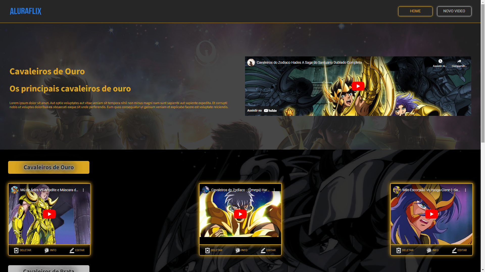

    

# Projeto AluraFlix

 > ℹ️ **NOTE:** Este é um repositório desenvolvido durante os meus estudos da formação React T6 - Especialização do programa [ONE](https://www.oracle.com/br/education/oracle-next-education/) e na plataforma da [ALURA](https://www.alura.com.br/).

## ✨ Features
✅ Bem vindos! Este é um projeto com o objetivo de criar uma aplicação em React com temática de uma das mais aclamadas séries de desenho anime chamada Cavaleiros do Zodíaco, com funcionalidades de ler, criar, atualizar e remover cards de forma funcional e dinâmica.

<a href="https://challenge-alura-flix-gold.vercel.app/" title="View Project now"> 📟 Clique aqui para visualizar a aplicação</a> 
<a href="https://github.com/VictorSamuraiWol/challenge-alura-flix" title="View Repository now"> 📜 Clique aqui para visualizar o reposiório</a>

## 💻 Tecnologias utilizadas no projeto

- [Trello](https://trello.com/) 
- [Figma](https://www.figma.com/)
- [Visual Studio Code](https://code.visualstudio.com/)
- [HTML](https://html.com/) 
- [CSS](https://www.w3.org/Style/CSS/Overview.en.html)
- [JavaScript](https://www.javascript.com/)
- [React](https://react.dev/)
- [Github](https://github.com/)
- [Vercel](https://vercel.com/)

## 👨‍💻 Estudante Front-end e AWS Cloud Computing

    
    
&nbsp&nbsp&nbspVictor Cardoso 
    &nbsp&nbsp<a href="https://github.com/VictorSamuraiWol">
    GitHub</a>&nbsp;|&nbsp;
    <a href="https://www.linkedin.com/in/victor-cardoso-cloud-front/">LinkedIn</a>

  

---

⌨️ com 💚 por [Victor Cardoso](https://github.com/VictorSamuraiWol)
